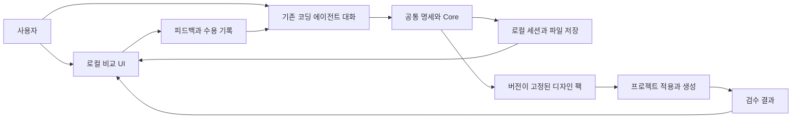

# 개인 AI 디자인 프레임워크 — 구조와 계약

구현 상태: Core 계약 v1.0, 로컬 세션 서비스·비교 UI·블록 화면 제출·고정 팩 재사용 제공.

제품 목적은 [PRODUCT.md](PRODUCT.md), 단계와 검증은 [PLAN.md](PLAN.md)에 정의한다. 실제 필드 계약은 `src/core/types.ts`, `src/schemas/contracts.ts`, `src/server/model.ts`, `src/server/screens.ts`를 기준으로 한다. 블록 화면의 파일 전달은 구현했고 자동 모델 실행·자유 코드 생성·Claude Code 실환경 검증 및 아래의 일부 개념 예시는 후속이다.

## 현재 Core 구현 범위와 한계

- JSON Schema/Ajv로 형식·추가 필드·버전을 검사하고, 별도 로직으로 참조·범위·CSS 값·수용 revision과 내용 해시를 검사한다.
- 충돌은 같은 `effect.key`에 다른 값이 있는 규칙에서 감지한다. 출처·수용 상태·범위·필수 여부는 추천에 사용하고, 사용자 답 없이 승자를 확정하지 않는다. 자유문 적용 조건은 보존하지만 자동 평가하지 않는다.
- 규칙 수용 이벤트는 내용 해시에 연결된다. 수정된 규칙에 이전 수용·충돌 답변을 그대로 적용하지 않는다.
- PackStore는 로컬의 신뢰된 호출자를 위한 API다. `actor: user` 필드는 인증이 아니며, 향후 서비스가 사용자 이벤트와 에이전트 제출 경계를 보장해야 한다.
- `<workspace>/packs/<pack-id>/v<version>/`에 pack.json·DESIGN.md·tokens.css·sources.json·CHANGELOG.md를 함께 저장한다. 임시 폴더 작성 후 이동, 배타 잠금·기준 버전 검사·requestId로 중복과 오래된 쓰기를 막는다. 이전 버전은 API로 덮어쓰지 않는다. 파일 권한으로 변조를 막거나 전원 장애까지 보장하는 데이터베이스는 아니다.
- tokens.css는 6자리 hex 색상, px/rem/em 간격, ms/s 시간, 제한된 폰트 이름만 지원한다. 전체 디자인 토큰 표준 지원은 후속이다.
- 프로젝트 바인딩은 팩 ID·버전·해시를 고정한다. 프로젝트 예외가 개인 팩을 수정하지 않는다. 변경 제안은 전후 값·이유·관련 자산과 프로젝트를 기록하며 적용은 별도 수용 단계다.
- 검수 보고는 실제 화면을 확인하지 않은 항목을 `not-run` 또는 `needs-review`로 표시한다. 시각적 품질을 통과 처리하지 않는다.
- 현재 assets/references는 메타데이터 계약이다. 실제 컴포넌트 파일·기준 스크린샷 복사·shadcn registry 내보내기는 미구현이다.

로컬 Workbench 구현:

- `src/server/`는 세션 revision 저장, 규칙 제안 제출, 브라우저 수용, 팩 저장 재시도와 내보내기/가져오기를 담당한다. 가져온 수용 이벤트는 확정 권한으로 사용하지 않는다.
- `src/workbench/`는 React UI이며 Node 서버에 Vite를 middleware로 연결한다. HMR/WebSocket 서버는 비활성화하고 시작한 두 HTTP 서버만 루프백에 바인딩한다. 개발 전용 서버다.
- 브라우저 API는 정확한 Host, HttpOnly·SameSite 쿠키를 확인하고 쓰기에는 Origin·전용 헤더·JSON 형식을 추가 확인한다. 쿠키는 실행 때마다 새로 생성하며 재시작 후 페이지를 다시 열어 발급받는다. 로컬 단일 사용자 실행 경계이며 계정 기반 인증은 아니다.
- 후보는 별도 origin의 빈 sandbox iframe과 제한된 CSP로 표시한다. 직접 작성한 예시 또는 에이전트가 구성한 Screen을 신뢰된 blocks-1.0 렌더러로 변환한다. 텍스트를 이스케이프하고 토큰 값·종류·블록·ID를 검증한다. 임의 HTML·CSS·스크립트·원격 자산·사용자 수용은 받지 않는다.
- 세션 파일은 `sessions/<id>/r<revision>.json`, 파생 전달 파일은 `handoffs/<id>.json`이다. 세션 잠금과 팩 게시 의도를 기록해 수용 후 저장 실패를 중복 수용 없이 재시도한다. 강제 종료로 남은 잠금·임시 파일의 자동 복구는 제공하지 않는다.
- 브라우저 임시 입력은 localStorage에도 보존한다. 세션·팩과 브라우저 저장소의 민감한 콘텐츠는 암호화하지 않는다. 공유 컴퓨터 사용을 위한 별도 데이터 관리 기능은 후속이다.

화면 생성·재사용 계약:

- `agent-task`와 UI의 AI 작업 전달이 최신 요청 파일을 만든다. Codex·Claude Code 읽기 지침은 [docs/AGENT_TASK.md](docs/AGENT_TASK.md)에 있으며 같은 agent-submit CLI를 사용한다. 별도 모델 API·자동 채팅은 없다.
- 첫 생성은 대기 피드백 없이 제출 가능하다. 이미 선택된 방향은 변경하지 못하며 초기 생성의 direction은 사용자 선택으로 기록하지 않는다. 충돌은 규칙만 먼저 제출해 질문하고, 답변에 따른 규칙으로 화면을 다시 제출한다.
- 화면 스냅샷은 내용·규칙·토큰·변경 이유·렌더러 버전·revision과 SHA-256 해시를 보존한다. 현재/이전 생성 화면을 비교하고 첫 생성 전에는 초기 예시를 표시한다. 규칙만 바뀌어 화면이 오래된 경우 수용을 거부한다.
- `generation` 필드가 없는 기존 세션은 읽을 때 빈 생성 상태로 호환한다. 이전 파일은 재작성하지 않는다. 가져오기는 화면 기록을 복사하되 규칙 수용·프로젝트 바인딩을 계승하지 않는다.
- 새 프로젝트는 저장된 팩의 ID·버전·해시에 연결된 ProjectBinding을 세션 안에 영속 저장한다. 규칙·토큰은 변경 없이 재사용하고 콘텐츠·섹션을 새 목적에 맞춘다. 프로젝트 화면 수용은 원본 팩을 게시하거나 바꾸지 않는다. 이번 단계에서는 프로젝트 예외·개인 팩 변경 UI를 제공하지 않는다.
- 구조·참조·방향과 지원 토큰 검증은 실행하지만 자유문 규칙 준수·접근성·취향 일관성을 자동 통과로 표시하지 않는다. 독립 스크린샷 기준 자산·설치 가능한 registry 출력·외부 MCP 연결은 후속이다.

## 1. 구성과 선택 이유

| 부분 | 책임 | 선택 이유 |
|---|---|---|
| Core | 스키마, 규칙 해석, 토큰·자산 연결, 버전·변경 검증 | 에이전트나 UI가 바뀌어도 동일한 계약 유지 |
| Local service | 작업 공간 내 파일 저장, 비교 세션, 피드백·수용 기록 | 브라우저와 에이전트가 같은 결과를 안전하게 공유 |
| Workbench | 목적 요약, 후보 비교, 피드백, 규칙·변경 수용, 검수 표시 | 사용자는 시각적 결과와 일상 언어로 결정 |
| Agent adapters | 기존 도구에 공통 명세·세션 경로·읽기 지침 전달 | 도구별 사용 방식과 핵심 데이터 분리. 첫 구현에 자체 AI 호출 없음 |
| Asset library | 토큰, 기본 컴포넌트, 화면 패턴, 기준 사례 | 생성마다 반복 구현하지 않고 검증 범위 통제 |
| Validation | 구조·동작·실제 화면·스타일 검수 | 명세와 구현을 함께 확인 |

데이터 흐름:



피드백에서 에이전트로 향하는 화살표는 첫 구현에서 다음 사용자 턴에 파일을 읽는 절차다. 자동 실행 연결은 후속 기능이다.

## 2. 기술 선택 — 첫 구현 제안

- TypeScript: Core·로컬 서비스·UI의 데이터 계약 공유.
- React + Vite: 로컬 비교 UI 및 첫 생성 예제의 웹 스택.
- CSS 변수: 확정 토큰을 스타일에 적용. UI 코드에서 임의 값이 증가하지 않게 함.
- JSON Schema: 저장·가져오기·AI 결과의 형식 검증. 의미상 충돌은 Core의 별도 검사로 처리.
- Node.js 로컬 서비스: 저장과 세션을 담당. 첫 구현에서 AI 모델을 직접 호출하지 않음.
- npm: 한 패키지와 단일 lockfile로 시작. 디렉터리는 분리하되 별도 패키지 발행은 후속.
- Playwright: 핵심 사용자 흐름·화면 크기·기준 스크린샷 검증 후보. 정적 규칙과 순수 로직은 작은 단위 테스트로 확인.

구체적인 패키지 버전·스키마 검증 라이브러리는 구현 시작 시 호환성을 확인하고 lockfile로 고정한다. 외부 UI 라이브러리 설치는 필수가 아니다. 필요한 기반을 선택하더라도 개인 스타일과 라이선스 조건을 확인한다.

첫 구현부터 자체 자산 카탈로그에 shadcn registry 형식의 내보내기를 설계한다. 로컬 Core는 이를 해석해 사용할 자산을 결정하고, 원격 Registry/MCP 연결은 후속으로 둔다. 따라서 코드 공급 계층의 참고 설계와 실제 외부 서비스 연동을 구분한다.

개발 요구사항은 Node.js 24 이상과 npm이다. Core·React·Vite·Playwright 의존성은 package-lock.json으로 고정한다.

공식 참고: [React](https://react.dev/learn), [Vite](https://vite.dev/guide/), [JSON Schema](https://json-schema.org/overview/what-is-jsonschema), [Playwright assertions](https://playwright.dev/docs/test-assertions). 선택 이유는 이 프로젝트의 설계 판단이며 공식 문서의 추천으로 표현하지 않는다.

## 3. 예정 디렉터리

```text
PRODUCT.md / ARCHITECTURE.md / PLAN.md / AGENTS.md
src/
  core/              # 규칙 해석·검증·버전·변경
  schemas/           # 팩·브리프·세션·결과 계약
  server/            # 로컬 파일 및 세션 서비스
  workbench/         # 사용자 비교·피드백·수용 UI
  adapters/          # 공통 작업 명세와 에이전트별 전달
  assets/            # 기본 토큰·컴포넌트·화면 패턴
examples/
  service-page/      # 서비스 소개·문의 예제
  personal-portfolio/ # 다른 제품 재사용 예제
tests/               # 의미 있는 계약·동작 테스트
.design-workspace/   # 로컬 사용 데이터; Git 제외
  sessions/
  packs/<pack-id>/<pack-version>/
  projects/<project-id>/
```

개인 팩은 `.design-workspace` 안의 자료와 외부에 내보낼 자료를 분리한다. 현재 구현 경로는 `src/core/`, `src/schemas/`, `src/server/`, `src/workbench/`, `tests/`, `e2e/`, Core 예제다. 도구별 어댑터·실제 AI 생성 화면 예제는 예정 사항이다. `.design-workspace/`는 Git에서 제외한다.

## 4. 개인 팩과 프로젝트 데이터

### 4.1 데이터 객체

| 객체 | 핵심 내용 |
|---|---|
| ProductBrief | 대상, 주요 과제, 콘텐츠, 환경, 우선순위, 제약 |
| DesignPack | 개인 규칙, 토큰, 패턴·컴포넌트 참조, 기준 화면, 결정 권한, 검수 정책 |
| ProjectBinding | packId·packVersion·packHash, 브리프, 허용된 예외, 생성 결과 참조 |
| DesignSession | 후보, 피드백, 규칙 제안, 사용자 수용, 실행 상태 |
| ChangeProposal | 이전/이후, 이유, 영향, 적용 범위, 대안, 수용 상태 |
| ConflictRecord | 충돌한 규칙과 출처·버전, 영향, 질문, 대안, 사용자 답, 적용 범위·상태 |
| ReferenceCatalog | 외부 참고 항목의 URL·버전·활용 방식·적용 조건·사용자 채택 여부 |
| ValidationReport | 규칙별 결과·증거·검사 방식·미확인 항목 |

팩은 제품별 상세 브리프를 그대로 영구 선호로 저장하지 않는다. 예컨대 소개 페이지의 문의 버튼 위치는 프로젝트 요구일 수 있으며, 모든 다음 프로젝트의 개인 규칙이 되지 않는다.

### 4.2 팩 파일 구성

- `pack.json`: 구조화된 원본. 스키마 버전과 팩 버전을 별도 저장.
- `DESIGN.md`: 확정 규칙의 에이전트용 읽기 문서. JSON에서 생성하고 직접 수정 시 불일치를 탐지.
- `tokens.css`: 토큰에서 생성한 스타일 변수.
- `assets/`: 사용 가능한 소스·패턴, 해당 버전, 의존성·라이선스.
- `references/`: 사용자가 받아들인 기준 화면과 화면 크기, 브리프/토큰/자산 해시, 생성 소스 참조.
- `CHANGELOG.md`: 버전 간 이유·영향·변경 요약.
- `sources.json`: 채택한 참고 항목의 출처·버전·해시·적용 범위·라이선스·채택 근거. 외부 원문 전체를 자동 복제하지 않는다.

외부 사이트 스크린샷·코드가 재배포 가능한 것으로 가정하지 않는다. 기본 팩에는 직접 작성한 자산을 사용하고, 참고 URL과 외부 자산의 출처·사용 조건을 기록한다.

### 4.3 규칙 계약 예시

```json
{
  "id": "prefer-clear-primary-action",
  "statement": "방문자가 첫 화면에서 핵심 작업을 찾을 수 있게 한다.",
  "intent": "작업 시작점을 쉽게 식별하게 한다.",
  "scope": "project",
  "strength": "required",
  "status": "proposed",
  "origin": { "type": "user-feedback", "feedbackId": "feedback-demo-01" },
  "appliesWhen": ["첫 화면에 주요 실행 작업이 존재함"],
  "verification": { "method": "human-visual", "evidence": "첫 화면과 주요 작업의 위치" }
}
```

규칙의 범위와 강도는 서로 다르다. 개인 규칙도 선호일 수 있고 프로젝트 규칙도 필수일 수 있다. 자유문 텍스트만 비교하지 않고 적용 조건·참조·상태를 함께 검사한다. 위 JSON은 규칙 한 개의 예시이며 전체 스키마는 구현 단계에서 만든다.

외부 참고로부터 도출한 규칙에는 `origin.type=framework-reference`와 sourceId·원문 URL·버전 또는 조회일·적용 조건을 둔다. 사용자에게 채택된 규칙에는 adoptionDecisionId를 연결한다. 출처가 참고 프레임워크라는 이유만으로 그 규칙이 필수 규칙이나 사용자 합의가 되지 않는다.

피드백에서 추론한 규칙은 `proposed` 상태로 시작한다. 인간이 수용하기 전에는 `accepted`로 변경하거나 기존 팩을 덮어쓰지 않는다. 부정·부분 수용은 각 규칙 ID에 기록한다.

## 5. 규칙 우선순위와 충돌

### 5.1 기본 원칙

우선순위는 질문 전의 추천 근거이며, 감지한 충돌을 AI가 일방적으로 처리하는 근거가 아니다. 사용자 요구와 참고 프레임워크, 개인 팩, 프로젝트 요구, 품질 기준 사이에 미해결 충돌이 있으면 영향을 설명하고 사용자에게 질문한다.

규칙 범위·필수/선호·출처·수용 여부를 함께 해석한다. '최근에 읽은 문서'나 '유명한 프레임워크'라는 이유로 우선권을 주지 않는다. 실제 API·컴포넌트 계약과 시각적 권고도 구분한다.

### 5.2 추천 우선순위

| 순서 | 근거 | 처리 |
|---|---|---|
| 1 | 해당 충돌·범위에 대한 사용자의 명시적 결정 | 유효한 범위·버전에 적용. 이미 답한 사항 재질문 금지 |
| 2 | 현재 프로젝트에 대한 명시적 사용자 요구 | 기존 규칙과 충돌하면 변경·예외 범위를 묻고 추천안 제시 |
| 3 | 확정 개인 규칙과 승인된 프로젝트 예외 | 같은 범위에서는 승인된 예외 적용. 새 충돌은 질문 |
| 4 | 사용자가 아직 채택하지 않은 외부 디자인 원칙·레퍼런스 | 추천 근거로만 사용. 사용자 요구를 자동으로 덮어쓰지 않음 |
| 5 | AI의 추정·일반 기본값 | 확정 규칙 안의 빈 부분만 채움. 추정을 사용자 선호로 저장하지 않음 |

서로 양립 가능한 규칙은 함께 적용한다. 같은 수준에서 서로 모순되거나 적용 범위가 불명확한 규칙은 자동 병합하지 않고 질문한다. 사용자 요구와 외부 권고의 충돌에서는 사용자 의도를 유지하는 대안을 우선 추천하되 선택을 기다린다.

### 5.3 품질 조건과 실제 제약

공통 품질 기준은 별도 검사 축이다. 디자인 권고를 변경 불가능한 표준으로 간주하지 않으며, 사용자 요구와 품질 기준이 충돌하면 구체적 영향과 대안을 설명해 질문한다. 사용자가 기준 변경을 선택하면 해당 범위에 기록한다. 이전 검사에서 실패한 항목을 기록 없이 통과 처리하거나 전체 품질이 보장됐다고 표시하지 않는다.

실제 컴포넌트 API·브라우저 기능·자산 사용 허가 등은 질문만으로 바꿀 수 없다. 불가능한 요청을 실행 가능하다고 제시하지 않고, 다른 자산 사용·구조 변경·기능 범위 조정 같은 실행 가능한 선택을 제공한다. 접근 권한 없는 레퍼런스는 이용할 수 없음을 표시하고 대체한다.

### 5.4 질문·응답 계약

1. 충돌한 항목의 ID·원문 의미·출처·적용 범위를 확인한다. 이미 해결된 결정이 적용되는지 먼저 검사한다.
2. 충돌의 종류를 분류한다: 사용자↔외부 원칙, 프로젝트↔개인 규칙, 규칙↔규칙, 품질↔표현, 자산/기술 제약.
3. 한 질문에 차이·추천 이유·영향을 요약하고 2~3개의 실행 가능한 선택지를 제공한다. '이 프로젝트만 변경'과 '개인 규칙도 변경'을 구분한다.
4. 질문·대안·대상 revision을 ConflictRecord에 기록하고 `awaiting-user`로 둔다. 응답 전 관련 생성·규칙 확정을 대기시키되 충돌 없는 작업은 계속할 수 있다.
5. 답변을 사용자 결정 이벤트로 저장한다. 사용자가 외부 원칙 대신 자신의 요구를 택하면 외부 규칙의 적용 제외를 명시한다.
6. 결정에 따라 화면·규칙을 갱신한다. 개인 팩 변경은 이미 승인된 범위가 있으면 중복 확인하지 않고 새 버전에 반영한다.

응답 없는 시간 경과를 승인으로 해석하지 않는다. 미해결 충돌이 생긴 결과는 탐색용 미리보기로 제공할 수 있지만 확정된 팩이나 규칙 준수 결과로 저장하지 않는다.

### 5.5 충돌 예시

| 상황 | 사용자에게 제시할 질문과 추천 |
|---|---|
| 외부 지침은 특정 폰트를 피하라고 하고 사용자는 그 폰트를 요청 | '요청하신 폰트와 참고 지침이 다릅니다. 요청하신 폰트를 유지할까요, 대체 후보를 비교할까요?' 사용자 폰트를 유지하는 안 추천 |
| 참고 화면은 모션이 많고 사용자는 정적인 화면을 원함 | '참고 화면의 배치는 유지하고 모션만 제외할까요, 다른 정적 레퍼런스를 사용할까요?' 배치만 참고하는 안 추천 |
| 개인 팩은 큰 이미지 사용, 프로젝트에는 이미지 없는 목록 | '이번 목록에서만 이미지 규칙을 제외할까요, 개인 규칙을 이미지가 있는 경우에만 적용하도록 바꿀까요?' 프로젝트 예외 추천 |
| 사용자는 낮은 대비를 요청하고 가독성 검사 실패 | '인상을 유지하며 대비를 높일까요, 이 범위의 기준 변경을 기록할까요?' 읽기 가능한 대안 추천, 실패 사실 유지 |
| 외부 컴포넌트가 요구 동작을 지원하지 않음 | '같은 인상의 다른 컴포넌트를 사용할까요, 해당 동작을 직접 구현할까요?' 비용·유지보수 영향 함께 표시 |

## 6. 협의와 생성의 상태

```text
brief-draft → brief-ready → candidates-ready
  → feedback-recorded → rules-proposed → awaiting-acceptance
  → pack-persisted → project-generated → validated
```

수정은 후보·규칙 제안 단계로 돌아간다. 실패·중단은 별도 상태와 복구 지점을 갖는다. UI에서 제출·저장·검수 중 상태를 구분하고 중복 클릭으로 버전이 두 개 생기지 않게 한다.

세션마다 안정적인 ID·revision을 저장한다. 피드백과 수용 요청은 대상으로 삼은 후보·규칙 ID와 revision을 명시한다. 오래된 화면에서 새 규칙을 수용하는 요청은 충돌로 반환하고 최신 비교 화면을 보여준다.

브리프와 피드백은 먼저 임시 저장한다. 규칙 변경을 거부하거나 실행이 실패해도 사용자 입력을 잃지 않는다. 재시작 후 마지막 완료 지점에서 이어간다.

## 7. 에이전트 연결 — 첫 단계의 실제 범위

### 7.1 대화와 브라우저 제공

첫 구현에서 Agent adapters는 자체 모델 실행기가 아니라 **기존 에이전트에 전달할 작업 지침·요청·결과 계약**이다. 대화는 Codex의 기존 대화창 또는 Claude Code의 기존 대화 인터페이스에서 제공한다. 로컬 브라우저에는 새 채팅 모델을 붙이지 않는다.

개발자가 하나의 실행 절차로 비교 UI·저장 API와 별도 미리보기 서버를 시작한다. 예정 주소는 `http://127.0.0.1:<실제 포트>/sessions/<세션 ID>`다. 서버가 시작되고 경로가 준비된 후에만 실행 주소를 대화에 제공한다. 내장 브라우저를 열 수 있는 환경에서는 그 패널을 사용하고, 나머지 환경에는 일반 브라우저 링크를 제공한다.

첫 시동·의존성 구성은 개발 작업이다. 비전문가에게 매 세션마다 설치·포트·파일 형식을 선택시키지 않는다. 최종 배포용 원클릭 설치는 이후 패키징 범위다.

브라우저는 다음 책임만 갖는다: 목적·후보 표시, 피드백·충돌 답변·수용 입력, 상태 확인. 로컬 API는 sessionId·revision·대상 ID를 검증하고 기록한다. 에이전트는 파일 계약으로 이를 읽는다. UI는 revision을 주기적으로 조회해 새 결과를 반영하고 충돌 질문과 답을 기존 대화와 중복 기록하지 않는다.

예정 서비스 계약:

| 작업 | 입력·출력 | 담당 |
|---|---|---|
| 세션 표시 | 브리프·후보·상태·revision·미해결 충돌 | 로컬 API → 브라우저 |
| 피드백/충돌 답변 저장 | 대상 ID·revision·자연어 답변·선택 범위 | 브라우저 → 로컬 API |
| 규칙 수용 | 제안 ID·revision·수용한 규칙 ID | 브라우저 → 로컬 API → Core |
| 후보·규칙 제출 | requestId·입력 해시·소스·참조·제안 | 기존 에이전트 → 제출 파일 → Core |
| 결과 갱신 | 검증된 제출물로 새로운 revision | 로컬 서비스 → 브라우저 |

Core가 검증하기 전 제출 파일은 임시 결과다. UI는 임의 제출 경로나 에이전트의 수용 주장을 확정 이벤트로 취급하지 않는다.

### 7.2 실제 반영 순서

1. 사용자가 에이전트에서 작업을 시작한다.
2. 에이전트가 브리프·후보 소스·규칙 제안을 검증 가능한 파일로 제출한다.
3. 로컬 UI가 후보를 렌더링하고 피드백·수용 이벤트를 저장한다.
4. 사용자가 기존 에이전트 대화에서 '저장한 피드백을 반영해줘' 등으로 다음 턴을 시작한다. 브라우저 제출만으로 에이전트가 실행되지는 않는다.
5. 에이전트는 세션 파일을 읽고 규칙과 화면을 수정한다.
6. Core와 로컬 서비스는 실제 수용 이벤트를 검증한 후 팩 버전을 저장한다.

UI에는 '피드백 저장됨'과 'AI 반영 완료'를 별도로 표시한다. 수동 재개가 필요한 이유를 명확히 표시하되 사용자가 JSON 복사·기술 설정을 반복하도록 만들지 않는다.

공통 요청은 작업 ID, 브리프·팩 해시, 작업 종류, 입력/출력 경로, 허용 자산, 검수 조건을 포함한다. 결과는 후보·규칙·변경·생성 소스·검수 증거를 포함한다. 에이전트가 텍스트에서 수용됐다고 주장하는 것만으로 수용 처리하지 않는다.

Codex와 Claude Code용 전달 파일·작업 지침은 이 공통 명세에서 생성한다. 실제 연결 확인 전에는 '두 도구 자동 연동 완료'라고 표시하지 않는다. 완전 자동 브라우저 경험은 이후 실행 어댑터의 가용성·인증·비용·취소·실패 처리를 정한 후 구현한다.

### 7.3 API 키와 인증

| 실행 방식 | 인증 | 첫 구현 여부 |
|---|---|---|
| 로그인된 기존 Codex/Claude Code에서 대화 | 기존 도구의 계정 로그인 또는 해당 도구에서 설정한 인증 | 첫 구현. 우리 서비스가 자격 증명을 가져오지 않음 |
| 자체 백엔드에서 모델 API 직접 호출 | 제공자 API 키 등 해당 API의 인증 | 후속. 제공자·비용·저장 위치 협의 후 연동 코드 작성 |
| 기존 도구의 공식 실행 인터페이스로 브라우저 대화 자동화 | 도구별 공식 인증·실행 권한 | 후속. 지원 여부를 실제 검증해야 함 |

Codex는 ChatGPT 로그인과 API 키 인증을 지원하며 Claude Code도 계정 로그인 방법을 제공한다. 따라서 '에이전트라는 이유로 언제나 별도 API 키가 필요하다'고 보지는 않는다. 반면 우리 앱이 OpenAI API를 직접 호출하는 방식에서는 API 인증을 별도로 설정해야 한다. 기존 구독 로그인은 우리 서비스에 API 호출 권한을 자동 부여하지 않는다.

근거: [Codex 인증](https://learn.chatgpt.com/docs/auth), [Claude Code 인증](https://code.claude.com/docs/en/authentication), [OpenAI API quickstart](https://developers.openai.com/api/docs/quickstart).

개발용 에이전트의 로그인과 이 제품을 사용하는 사용자의 로그인도 구분한다. API 모드가 필요해지면 호출 코드를 작성·실행하기 전에 제공자, 비용, 기존 키 재사용/신규 설정, 로컬 저장 위치를 협의한다. 키를 일반 대화에 붙여넣으라고 요청하지 않고 브라우저 번들·팩·검수 로그에 넣지 않는다. 현재는 문서 수정 단계로 인증 조회·키 요청·API 호출을 하지 않는다.

## 8. 저장·버전·내보내기

- 수용된 팩 버전의 내용은 불변으로 취급한다. 변경은 새 버전으로 저장한다.
- 프로젝트는 정확한 팩 버전과 내용 해시에 연결한다. 최신 버전을 자동 추적하지 않는다.
- 스키마 버전과 디자인 팩 버전은 별도 필드다. 호환되지 않는 스키마는 이유와 변환 필요성을 표시한다.
- 첫 구현의 팩 버전은 단순 증가 버전으로 관리하며 호환성 의미를 임의로 부여하지 않는다.
- 저장은 임시 파일 작성·검증 후 원자적 교체를 사용한다. revision 비교와 동일 요청 ID의 중복 방지 적용.
- 초기 내보내기는 JSON manifest와 자산 폴더로 한다. 압축 배포는 경로 검증을 마련한 이후 추가한다.
- 내보내기에는 디자인 자산과 확정 규칙을 넣고 원문 대화·개인 정보·환경 비밀값은 기본 제외한다.
- 기준 화면만으로 재현성을 주장하지 않는다. 소스·자산·토큰 버전을 고정해도 AI의 새로운 생성 결과에는 편차가 있을 수 있다.

## 9. 로컬 서비스와 미리보기 경계

이 절은 로컬 서비스와 미리보기의 구현 요구사항이다. 기본 요청 검사와 직접 작성한 후보의 실행 분리는 현재 제공한다. 임의 생성 코드 실행·계정 인증은 제공하지 않는다. PackStore 자체는 여전히 신뢰된 로컬 호출자를 위한 Core API다.

서비스는 로컬 주소에만 바인딩하고 전용 작업 공간에만 쓴다. 요청 origin과 세션 토큰을 검증하고, 사용자 파일 식별자를 임의의 절대 경로로 해석하지 않는다. 경로 정규화 후 작업 공간 밖을 가리키면 거부한다. 파일 크기·형식과 참조 자산 존재도 검사한다.

서비스가 임의 셸 명령 실행 API를 제공하지 않는다. 에이전트의 소스·실행 지침을 사용자 수용 이벤트로 해석하지 않는다.

생성 화면은 비교 UI와 분리된 미리보기 origin의 iframe에서 표시하고 동일 출처 권한을 주지 않는다. 부모 화면과 메시지를 교환할 때 창 참조·메시지 타입·세션 식별자를 검사한다. 첫 후보는 허용된 자산과 구조로 제한하고 임의 외부 스크립트·네트워크 호출을 포함하지 않는다. iframe만으로 임의 코드를 안전하게 실행한다고 주장하지 않는다. 자유 코드 실행은 후속 별도 실행 경계가 필요하다.

## 10. 검수와 품질 판정

검수 결과는 `pass / fail / needs-review / not-run`과 검사 방식·증거·대상 버전을 기록한다.

| 검사 | 증거 | 한계 |
|---|---|---|
| 구조·참조·규칙 충돌 | 스키마 결과와 참조 존재 | 자유문 의미 전체를 자동 검증하지 못함 |
| 토큰·자산 사용 | 소스 검사·허용 목록·빌드 결과 | 모든 CSS 표현을 완전히 분석한다고 주장하지 않음 |
| 사용자 동작 | 브라우저 시나리오·키보드 확인 | 테스트하지 않은 흐름은 미확인 |
| 반응형·콘텐츠 | 360/768/1280px, 긴 한국어 제목, 빈 값 | 모든 기기 검증을 의미하지 않음 |
| 상태 | 로딩·빈 상태·오류·재시도 재현 | 실제 서비스 오류와 데모 오류 구분 |
| 스타일 일관성 | 기준 화면·확정 규칙 대조 | 자동 점수로 취향 수용을 대신하지 않음 |

AI 검토는 보조 의견이며 인간 검토 완료로 표시하지 않는다. 공통 검사 실패가 있으면 수정 대상으로 표시하고 팩/생성 결과가 품질 보장됐다고 표현하지 않는다.

## 11. 계층별 프레임워크 활용 계획

여섯 계층은 논리적 디자인 책임이고 Core·Workbench·adapters는 이를 구현하는 소프트웨어 모듈이다. 각 계층을 관련 모듈·산출물과 연결해 출처와 채택 상태를 추적한다.

| 계층·출처 | 무엇을 참고하나 | 적용 모듈·산출물 | 초기 적용과 후속 연결 |
|---|---|---|---|
| 제품 맥락 — [Impeccable](https://github.com/pbakaus/impeccable) | 제품 사실과 시각 방향 구분, 초기 맥락 정리 | adapters의 질문 지침 → ProductBrief. 개인 팩에는 영구 취향만 반영 | 첫 구현부터 선별한 질문·기록 구조 적용. 전체 Skill 자동 설치는 하지 않음 |
| 디자인 방향 — [Refero Styles](https://styles.refero.design/) | 참고 화면의 타이포·레이아웃·색상·조건을 AI용 명세로 표현 | ReferenceCatalog → proposed rules → DESIGN.md·기준 화면 | 첫 구현은 직접 작성한 예시와 사용자 제공 자료로 시작. 외부 자료는 접근 가능한 범위에서 참조 |
| 디자인 토큰 — [Carbon](https://www.carbondesignsystem.com/building-blocks/foundations/color/overview)·[Spectrum](https://spectrum.adobe.com/foundations/design-data/design-tokens) | 역할 기반 토큰, 테마와 플랫폼별 적용 | core/schemas/assets → 토큰 원본·tokens.css·검사 | 첫 구현부터 의미·참조·테마 구조 적용. 브랜드 팔레트와 컴포넌트 전체를 복제하지 않음 |
| 화면 패턴 — [Mobbin](https://mobbin.com/mcp)·[Refero](https://refero.design/) | 실제 과제별 화면과 흐름을 분류하는 방식 | assets의 패턴 명세: 과제·구조·상태·모바일·관련 자산 | 첫 구현은 자체 작성 패턴. 외부 검색/MCP는 사용자 계정·권한·비용 확인 후 추가 |
| 코드 공급 — [shadcn Registry](https://ui.shadcn.com/docs/registry/getting-started)·[MCP](https://ui.shadcn.com/docs/mcp) | 파일·의존성·자산 카탈로그와 탐색/설치 연결 | assets/adapters → 자산 manifest·registry 내보내기·토큰/패턴 참조 | 초기 로컬 카탈로그·registry 호환 출력 검증. 원격 게시와 MCP 연결은 후속 |
| 검수 — Impeccable·[Vercel Web Interface Guidelines](https://github.com/vercel-labs/web-interface-guidelines) | audit/critique/polish 흐름, 키보드·반응형·내용·모션 점검 | ValidationReport·자동 검사·시각 검토 체크리스트·수정 제안 | 첫 구현부터 적용할 검사와 출처 명시. 자동 판정 불가능한 항목은 needs-review |

공급 원칙:

- '설계 참고', '직접 재사용 코드', '실시간 외부 연결'을 source 항목의 활용 방식으로 구분한다.
- 규칙·코드의 원문 URL, 버전/조회일, 변환 근거, 라이선스, 적용 조건과 채택 상태를 기록한다.
- 외부 지침 전체를 기본 프롬프트에 합치지 않고 해당 과제에 필요한 부분만 제공한다.
- 사용자 규칙·품질 기준과 충돌하면 5절의 질문 계약을 적용한다. 외부 자료가 질문 없이 우선권을 갖지 않는다.
- 외부 서비스 연결이 없어도 작동할 자체 자료를 제공한다. 외부 연결이 필요한 단계에서는 사용 가능 여부를 먼저 표시한다.
- 실제 포함하는 코드·문서의 재사용 조건은 구현 전에 확인한다. 설계 참고를 곧바로 원문 재배포로 해석하지 않는다.

## 12. 주요 설계 결정 기록

| 결정 | 선택 | 근거·트레이드오프 |
|---|---|---|
| 초기 사용자 표면 | 에이전트 + 로컬 비교 UI | 계정·모델 API 추가 없이 검증. 자동 재개는 후속 |
| 규칙 원본 | JSON + 읽기용 Markdown | 프로그램 검증과 AI 가독성 함께 확보. 생성 동기화 필요 |
| 저장 | 로컬 파일 | 이동·검토 용이. 팀 동기화는 제공하지 않음 |
| 재사용 | 버전 고정 + 프로젝트 예외 | 예측 가능한 변경. 업데이트 절차 필요 |
| 첫 코드 스택 | React + TypeScript + Vite | 한 스택에서 계약 검증. 다중 스택은 후속 |
| 첫 AI 통합 | 공통 명세 + 도구별 지침 | 도구 종속을 줄임. 실제 연결별 검증 필요 |
| 참고 프레임워크의 위치 | 출처 있는 권고·자산·검사 | 개인 취향의 대체물이 아님. 충돌 질문과 채택 근거 관리 |
| 자체 API 에이전트 | 첫 구현에 없음 | 기존 도구의 대화 이용. API 모드는 인증 협의 후 별도 개발 |
